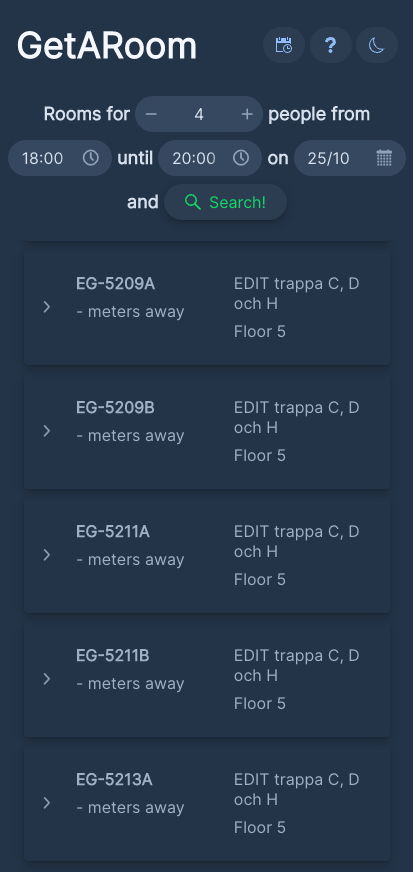
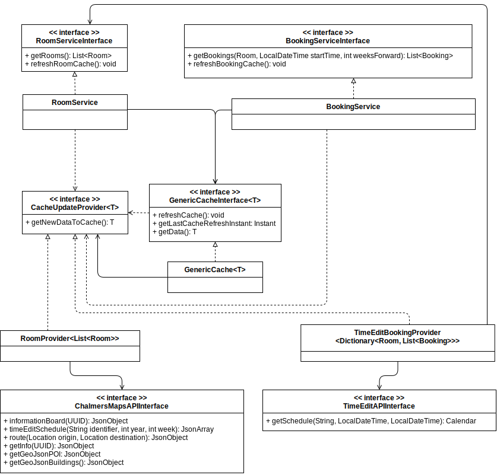

# **GetARoom**

Marcus Wernberger Jonsson
Oscar Eriksson
Gustaf Asplund

221024

<!-- 
---

# Denna presenentation

1. Bakgrund ot motivering
2. Demo
3. Systemdesign
4. Exempel på designmönster
5. Frågor och feedback

---

# Bakgrund och motivering

---

# Demo

## https://getaroom.spacenet.se/

---

## Domänmodell 

---

# UML

Öppnas separat..

--- 
-->

---

# Bakgrund och motivering

Hur hittar jag som student på Chalmers ett ledigt grupprum för min grupp på x personer?

---

# Bakgrund och motivering

Hur hittar jag som student på Chalmers ett ledigt grupprum för min grupp på x personer?

Det finns en bra app för att hitta till rummen (Campus Maps) och i TimeEdit går det att söka fram lediga rum inom ett visst tidsintervall. 

---

# Bakgrund och motivering

Hur hittar jag som student på Chalmers ett ledigt grupprum för min grupp på x personer?

Det finns en bra app för att hitta till rummen (Campus Maps) och i TimeEdit går det att söka fram lediga rum inom ett visst tidsintervall. 

Det saknas dock ett sätt att lätt hitta lediga grupprum som passar en specifik grupp. 

---

# Bakgrund och motivering

Hur hittar jag som student på Chalmers ett ledigt grupprum för min grupp på x personer?

Det finns en bra app för att hitta till rummen (Campus Maps) och i TimeEdit går det att söka fram lediga rum inom ett visst tidsintervall. 

Det ~~saknas~~ finns dock ett sätt att lätt hitta lediga grupprum som passar en specifik grupp. 

### GetARoom!

---

# Demo

[Deployad app](https://getaroom.spacenet.se/)

---

# Systemöversikt

En webapp skriven i:
- Spring Boot (webramverket inkl. DI)
- Vaadin (UI-komponenter + smidigt lager ovanpå)

Språk: Java, CSS, TypeScript (kartan)

---

# Systemdesign - Designguidelines

- Simpler is better
- Följa DIP för att kunna utöka kod utan att störa beroenden (OCP)
- Använda MVC för helheten
- Composition before Inheritance
- Följa ISP så mycket som möjligt

---

## Domänmodell 

---

# UML
[UML-diagrammet](assets/UML_221024.svg)

---

# Problem 1: API:er

Problemet: Hämta data från TimeEdit och Chalmers Maps

Lösning: Skapa egna API-klasser, dataproviders och `from`-parsers

- Separerar API från specifika datatyper
- Separation of concerns

---

# Problem 2: Caching

Problemet: Att hämta data från API:er tar mycket tid, ca 1,5 min

Lösning: Introducera ett cachelager som sparat data och kör uppdateringar på schema

---

# Problem 2: Caching

- Services har en `GenericCacheInterface<T>`
- `GenericCache<T> ` har `CacheUpdateProvider<T>` enligt Strategy-mönstret
- Uppdatering sker via `@Scheduled(cron = ...)`
- Separerar användning av data från uppdatering av data

---

# Problem 3: Mediator

Problemet: Kommunicera mellan view-komponenter utan att båda beror direkt på varandra

Lösning: Introducera en mediator

- Fördelar och nackdelar
- Vanligt sätt vs. detta sättet
- Observer + Mediator: `showMapButton.addClickListener(e -> mapMediator.notify("mapCalled"));`

---

# Problem 4: Fasad

Problemet: Vill kunna ändra i modellens implementation utan att klienter ska behöva bry sig

Lösning: Exponera endast ett väldigt litet interface

- Risker: God-object
- Specifik lösning: `GetARoomFacadeInterface` och records

---

# Problem 5: Beroende på konkreta klasser

Problemet: Vill undvika att klasser beror på konkreta implementationer

Lösning: Använda interfaces och dependency injection

- Skicka in konkreta klasser i konstruktorn
- Separation of Concerns till den som använder klassen

---

# Feedback

Tack för oss!

Testa appen själva: https://getaroom.spacenet.se/
